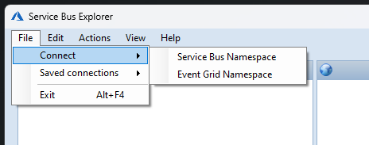
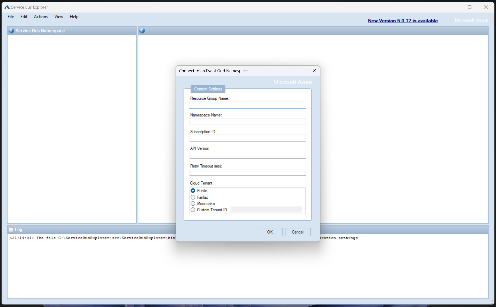
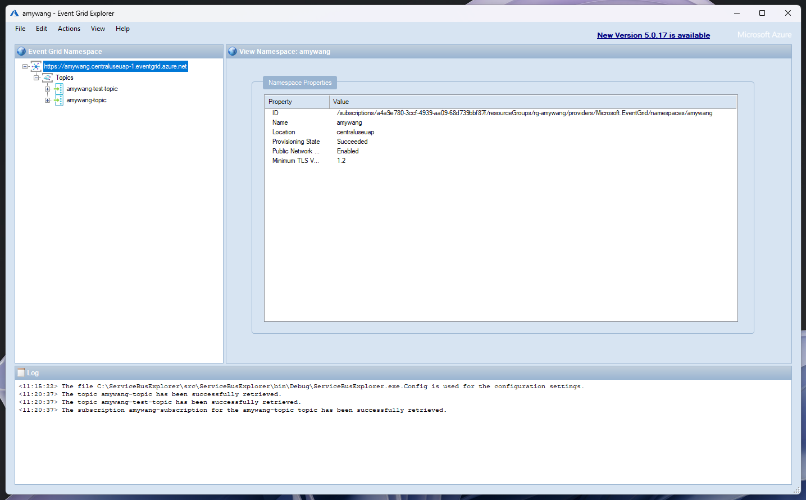
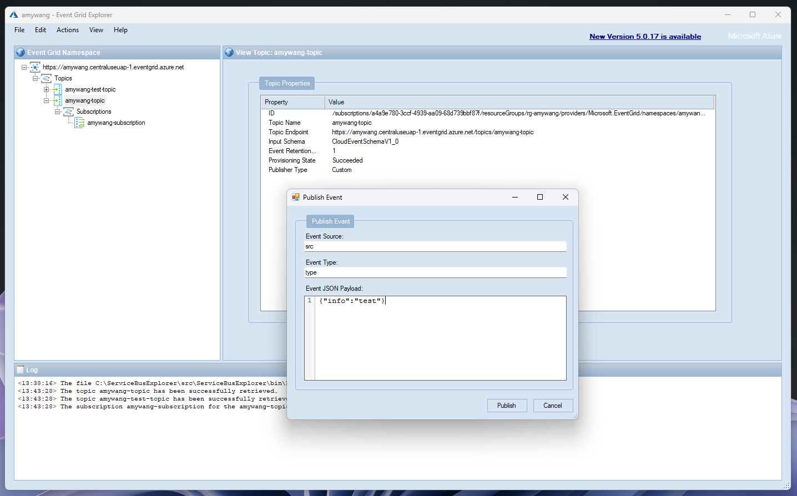
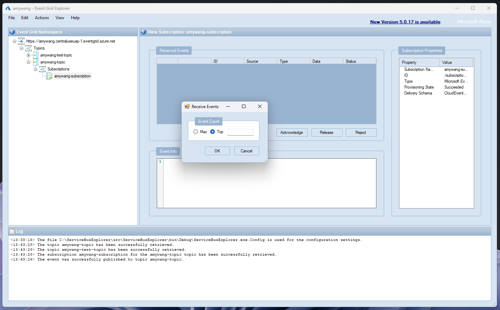
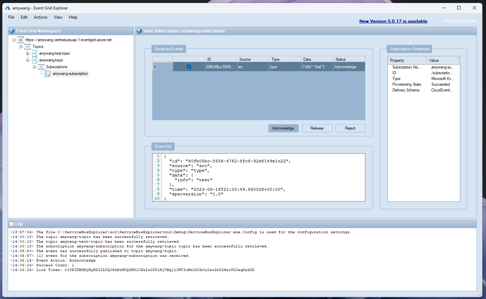

# Event Grid Explorer - Support for Event Grid V2 in Service Bus Explorer
**Author:** Amy Wang

The Event Grid Explorer provides a tool for viewing and managing Event Grid V2 entities, including namespaces, topics and subscriptions, as well as provide create/delete operations for topics and subscriptions, publish/receive operations for events, and acknowledge/release/reject operations for events.
Currently, the Event Grid Explorer features the functionality that is available for the preview version of Event Grid V2.
This additional support for Event Grid enables users to test event delivery with ease, contributing to the adoption of the new service.
Note: The EventGridExplorerLibrary uses models that are generated by Microsoft (R) AutoRest Code Generator

## Connect to Event Grid

Under the File tab, the user can connect to an Event Grid V2 namespace by providing the Resource Group, Namespace Name, Subscription ID, API Version, Retry Timeout and Cloud Tenant which selects the associated tenant ID.

## Main View

When the connection is successful, a tree view of the Event Grid V2 namespace with its contained topics and subscriptions is displayed along with properties views.
Right-clicking the Topics and Subscriptions nodes enables the user to create topics/subscriptions and right-clicking the existing topics and subscriptions enables the user to publish/receive events and delete these entities.

## Publish

When right-clicking the Publish option on a topic, the user can create and publish an event by entering the event source, type and JSON payload. 
Events are expected to use the CloudEvent format, as specified in the Azure SDK for .NET

## Receive

When receiving events through a subscription, the user can receive the maximum number of events (100) or a top number of events.
When successful, the data view table is populated with the received events and the event data is displayed in a JSON format.

## Event Settlement

On the received events listed in the table, the user can multi-select events to perform the acknowledge/release/reject operations.
When successful, the event status column is updated with the operation performed.

